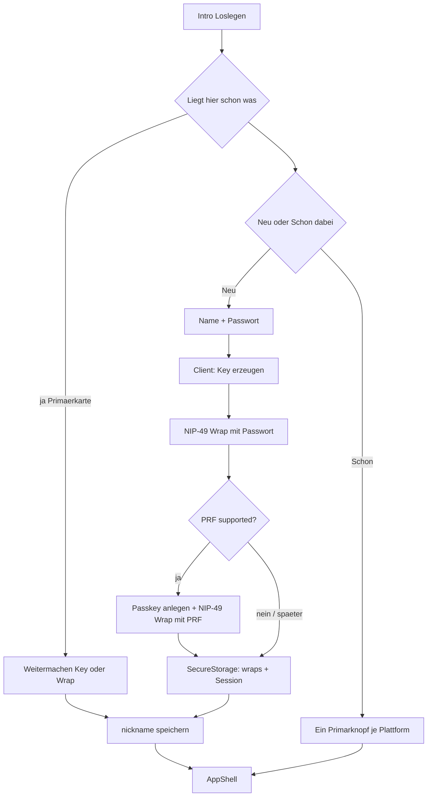

# Anmelde-UX: lokal EasyAuth + Passkey/PRF (ohne Backend)

**Branch:** `feat/identity-onboarding-easyauth`  
**Stand:** Implementierung auf dem Branch; Native-Passkeys brauchen noch Domain-Verknüpfung (siehe unten).

## Entscheidung (fest)

- **Variante 1:** EasyAuth-Crypto **nur im Client**, kein Identity-Vault, **keine Email**.
- Neu-Pfad: **Name + Passwort**, plus **Passkey/PRF** wie bei kickstr.
- Gerätewechsel: bestehendes Backup / ncryptsec-Export; Passkey-Sync nur wenn das OS die Passkey teilt (iCloud/Google) — kein eigener Server.
- **Name ≠ NIP-05:** Namensfeld = `UserProfile.nickname` / kind-0 Anzeigename. NIP-05 bleibt optional später im Profil (App verifiziert nur, legt keine NIP-05 an).

## Warum kein Backend nötig ist

kickstr-Client (`assets/js/easy_auth/`): Key erzeugen, NIP-49 mit Passwort; Passkey leitet per **WebAuthn-PRF** ein zweites Geheimnis ab und erzeugt einen **zweiten** `ncryptsec`-Wrap derselben Privkey. Der Server speichert bei kickstr nur opake Blobs + `credential_id` — für lokales EasyAuth liegen dieselben Blobs in Secure Storage.

kickstr-Spiele/Tipps-Backend ist für die Meetup-App irrelevant.

## Ziel-Flow

### Schritt 0–1

Intro → [`lib/screens/identity_setup_screen.dart`](../lib/screens/identity_setup_screen.dart): **Neu hier** / **Schon Nostr**. Backup-Restore als Sekundärlink auf Intro.

### Schritt 2a — Neu (Passwort + Passkey)

1. Feld **Name** (Pflicht) → Nickname / kind-0
2. Feld **Passwort** (+ Bestätigung) — immer; Fallback wenn kein PRF
3. Button **Loslegen** → Key + password-`ncryptsec`

Direkt danach (wenn Passkey/PRF verfügbar):

- Primär: **Mit Passkey sichern**
- Sekundär: **Später**

Ablauf (alles Client):

1. `NostrService.generateKeyPair()` → Session in SecureKeyStore
2. `Nip49.encrypt(priv, password)` → `password_ncryptsec` lokal ([`local_key_vault.dart`](../lib/services/local_key_vault.dart))
3. Optional: WebAuthn + PRF → zweiter Wrap + `credential_id` ([`passkey_prf_service.dart`](../lib/services/passkey_prf_service.dart))
4. Nickname setzen; kein Edu-Dialog
5. Optionales Sheet „Schlüssel sichern?“ — nicht blockierend

### Schritt 2c — Weitermachen (liegt schon etwas auf dem Gerät?)

Der Setup-Screen erscheint, wenn das **Profil** fehlt. Profil liegt in
SharedPreferences, Schlüssel im Keychain — nach einer Neuinstallation auf iOS
ist genau das der Fall: Profil weg, Schlüssel noch da. Ohne Abfrage bietet der
Screen dort „Neu hier" an und `register()` **überschreibt** den überlebenden
Schlüssel.

Deshalb prüft `_bootstrap()` drei Dinge (`SecureKeyStore.hasKey()`,
`LocalKeyVault.getPasswordWrap()`, `LocalKeyVault.hasPasskeyWrap()`). Trifft
eines zu, steht **„Schon auf diesem Gerät"** als Primärkarte oben, „Neu hier"
verliert die Primär-Optik:

1. Schlüssel im Keychain → nur `useLocalMode()`, kein Passwort nötig
2. sonst Passkey-Wrap → `unlockWithPasskey()`, Sekundärlink auf Passwort
3. sonst Passwort-Wrap → Feld + `unlockWithPassword()`

Danach `_finishIfOnboarded()`: ohne Namen → Namensschritt.

### Schritt 2b — Schon dabei

Ein Primär-CTA je Plattform (Extension / Amber / Bunker) via `SigningService.recommendedExistingPath`, darunter **Anderer Weg** (nsec/ncryptsec-Import, anderer Signer, Backup). Nach Erfolg ohne Name → Namensfeld.

## Passkey-Technik

- Dependency: [`passkeys`](https://pub.dev/packages/passkeys)
- Wrap-Store: `password_ncryptsec`, `passkey_ncryptsec`, `passkey_credential_id`
- **rpId:** Web = Hostname; Native = `einundzwanzig.space` (konfigurierbar)
- **Host-Erlaubnisliste im Web** (`PasskeyPrfService.allowedWebHosts`): nur
  `einundzwanzig.space`, `localhost`, `127.0.0.1`. Auf `razue.github.io` ist der
  Passkey **aus** — `github.io` ist eine geteilte Domain, die rpId gehört dort
  allen Projekten gemeinsam. `isSupported()` meldet auf nicht freigegebenen
  Hosts `false`, `register()` wirft zusätzlich `RP_ID_NOT_ALLOWED`.
- Graceful degrade: kein PRF / Domain nicht verknüpft → nur Passwort
- Passkey ist **zusätzlicher Unlock**, ersetzt das Passwort nicht
- **PRF-Wrap mit `logN: 8`** (nicht 16): das „Passwort" ist ein 256-Bit-Secret,
  da gibt es nichts zu erraten. Gemessen im Browser: 214 ms statt 38 s. Dieser
  Wrap wird deshalb nie exportiert.

### Warum kickstr „einfach“ war, Native nicht

kickstr ist eine **Website**: `RP_ID = window.location.hostname`. Der Browser ist die Relying Party.

iOS/Android-Apps sind kein Browser auf dieser Domain. Passkeys für `einundzwanzig.space` brauchen den Nachweis, dass die App zur Domain gehört:

| Plattform | Was fehlt noch |
|-----------|----------------|
| **Web** | nichts Extra — Host = rpId (wie kickstr) |
| **iOS** | Associated Domains (`webcredentials:einundzwanzig.space`) + Datei `https://einundzwanzig.space/.well-known/apple-app-site-association` (Team-ID + Bundle `de.einundzwanzig.einundzwanzigMeetupApp`) |
| **Android** | `https://einundzwanzig.space/.well-known/assetlinks.json` (Package `space.einundzwanzig.meetup` + SHA-256 Signing-Zertifikat) |

Ohne Domain-Kontrolle: andere Domain wählen und `_nativeRpId` in `passkey_prf_service.dart` anpassen — oder Passkey nur auf Web anbieten.

## Implementierte Bausteine

| Stück | Pfad |
|-------|------|
| Setup-UI | `lib/screens/identity_setup_screen.dart` |
| EasyAuth | `lib/services/local_easy_auth.dart` |
| Vault | `lib/services/local_key_vault.dart` |
| Passkey/PRF | `lib/services/passkey_prf_service.dart` |
| Path-Hilfe | `SigningService.recommendedExistingPath` |
| Tests | `test/local_easy_auth_test.dart`, `test/local_key_vault_test.dart`, `test/recommended_existing_path_test.dart` |
| Web-Test (Chrome) | `test/passkey_rp_id_web_test.dart` — `flutter test --platform chrome` |

## Zurücksetzen

`home_screen._performReset()` löscht `LocalKeyVault.clearAll()` mit. Der
Passwort-Wrap ist eine **vollständige Kopie** des privaten Schlüssels; ohne diese
Zeile überlebt die Identität ein „Zurücksetzen", von dem der Nutzer das Gegenteil
erwartet.

## Export

`profile_edit._exportNcryptsec()` gibt den **vorhandenen** Passwort-Wrap heraus,
statt scrypt erneut zu rechnen (0,4 s auf dem Gerät, ~38 s im Browser). Wer ein
anderes Passwort will, bekommt im Blatt den Sekundärweg
„Mit einem anderen Passwort erzeugen".

## Bewusst nicht im Scope

- Email und Cross-Device-Email-Login / Identity-Vault-Backend
- NIP-05 als Onboarding-Schritt
- Redesign des gesamten Profils
- Server-seitige WebAuthn-Assertion-Verifikation

## Erfolgskriterium

- **Neu ohne PRF:** Name + Passwort + Loslegen → `AppShell`
- **Neu mit PRF:** zusätzlich ein Passkey-Tipp (oder „Später“)
- **Schon dabei:** ≤ 2 Tipps auf Happy Path
- Max. ein Primär-CTA + ein Sekundärlink pro Screen
- Name = Nickname, nicht NIP-05; kein Backend für Auth-Blobs
